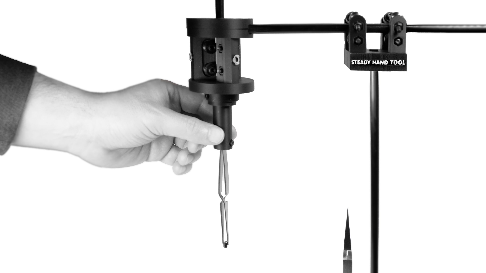
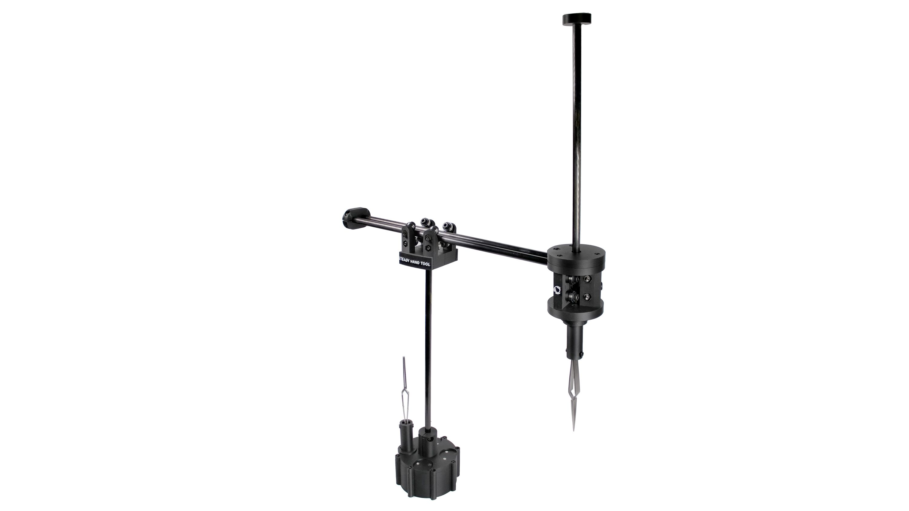
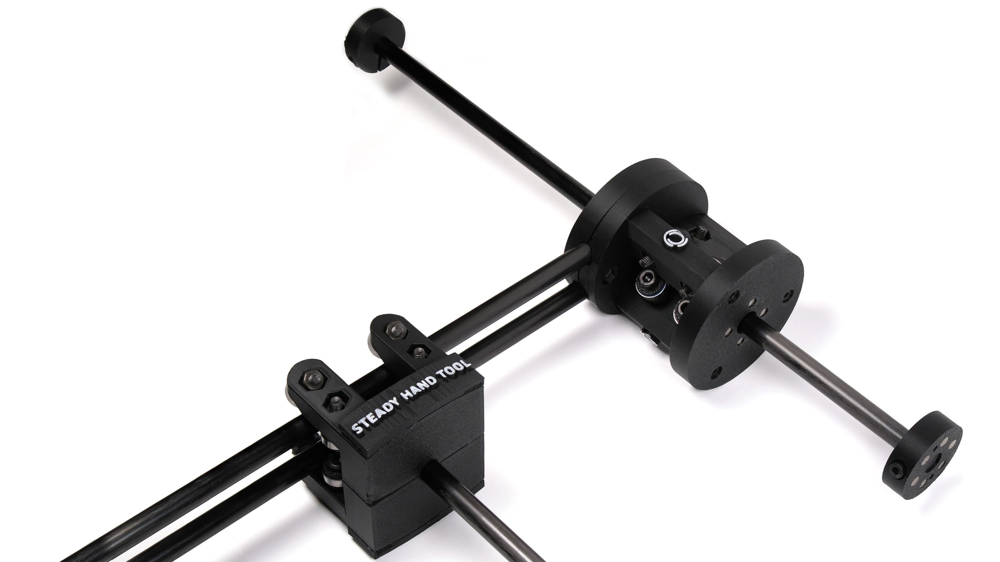

# Steady Hand Tool

[](https://halfmarble.com/blogs/news/steady-hand-tool)

<p align="center">
  
  <br>
</p>
<p align="center">
  
  <br>
</p>
<p align="center">
  
  <br><br><br>
  <em>Steady Hand Tool — when you need help holding down really tiny parts.</em>
</p>

## See it in Action
<p align="center">
  <a href="https://www.youtube.com/watch?v=Imng8o2QRBg">
    
  </a>
  <br>
  <em>Demonstrating the stability and precision of the Steady Hand Tool.</em>
</p>

---

Steady Hand Tool is a manual SMD (Surface Mount Device) assembly stabilizer designed to help makers and professionals prototype PCBs with high precision. Originally created to overcome physical challenges—specifically hand tremors caused by Parkinson’s disease—this tool makes high-accuracy soldering accessible to everyone.

## 🌟 Key Features

* **Stabilized 4-DOF Movement:** Keeps your hand on a steady track while allowing full vertical and horizontal reach.
* **Near-Zero Friction:** Equipped with **14 high-quality metal bearings** and carbon fiber rods for smooth, silent, and effortless operation.
* **Modular Magnetic Coupler:** Features a quick-swap magnetic system for changing tool heads (tweezers, vacuum tips, etc.) in seconds.
* **Purely Mechanical:** No power required, no cables, and no noise. It's always ready to work when you are.
* **Heavy-Duty Base:** A weighted **680g (1.5 lb)** base ensures the arm remains stable even at full extension.
* **Open Source:** Designed to be hacked and customized. Create your own tool heads to suit your specific workflow.

## 🛠 Technical Specifications

* **Reach:** Approximately 250 mm (9.8 in) vertical and horizontal travel.
* **Construction:** 3D-printed components (optimized for PETG/Carbon Fiber) and 8mm carbon fiber rods.
* **Bearings:** MR128ZZ precision shielded bearings.
* **Compatibility:** Designed to support a pair of specialized reverse tweezers optimized for 0805-size components and smaller.

> [!TIP]
> **Looking to build it?** Check out our [Assembly Guide](https://github.com/gerard-hm/steady-hand-tool/blob/main/docs/assembly-guide.md) for step-by-step instructions.

## 📂 Repository Structure

```
steady-hand-tool/
├── .github/                # Issue templates and GitHub-specific config
├── hardware/               # All physical design files
│   ├── models/             # 3D models for printing
│   │   ├── stl/            # Ready-to-print files (standard)
│   │   ├── step/           # High-fidelity files for CAD software
│   │   └── community/      # User-submitted tool heads
│   ├── electronics/        # (Optional) If you ever add sensors/LEDs
│   └── reference/          # Technical drawings or dimension sheets
├── docs/                   # Documentation and guides
│   ├── assembly-guide.md   # Step-by-step build instructions
│   ├── images/             # Photos and GIFs used in the guides
│   └── calibration.md      # How to tune the arm for smooth movement
├── media/                  # High-res logos and marketing photos
├── .gitignore              # Tells Git which files to ignore (like temp CAD files)
├── BOM.md                  # Bill of Materials (the "Shopping List")
├── CONTRIBUTING.md         # How others can help
├── LICENSE                 # CERN-OHL-S-2.0 License text
└── README.md               # The front page of your project
```

---

## ⚙️ Our Mission
The Steady Hand Tool is an engineering response to a personal slice of PD hell. It exists because "making" is a vital part of staying human. We believe that no one should be forced to retire their soldering iron just because their biology is putting up a fight.

## ⚓ Our Support
This is a race against time and biology. Support this project by helping us optimize the hardware for the next generation of makers facing similar constraints. Feedback, code, and mechanical iterations are the fuel that keeps this engine running.

<p align="left">
  <a href="https://give.michaeljfox.org/give/421686/#!/donation/checkout">
    
  </a>
  <br>
  <em>If this tool has been helpful to you, please consider supporting the <b>Michael J. Fox Foundation</b> in their mission to find a cure for Parkinson’s.</em>
</p>

---

## License

This project is licensed under the [**CERN-OHL-S-2.0 License**](https://choosealicense.com/licenses/cern-ohl-s-2.0/) - see the [LICENSE](LICENSE) file for details.

---

## Credits

**Photography:** Hero images provided by [Crowd Supply](https://www.crowdsupply.com).
